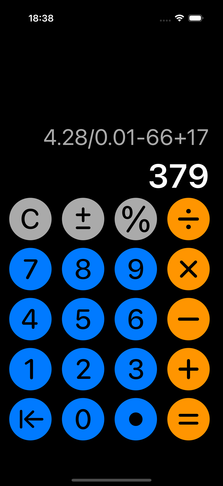

# Calculator

- This calculator supports all simple arithmetic operations, working with fractional and negative numbers and finding the percentage of a number.

- In addition, it can perform several calculations at a time.

- However, they will be performed sequentially, as I have not implemented the functionality to prioritize the execution of actions.

- Also, if the user enters more than 12 characters, a warning will pop up that the output may not fit on the screen.

- Enjoy using it!
