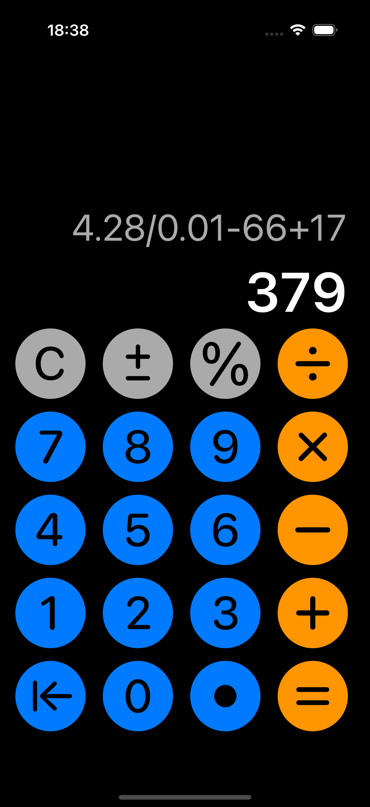

# Калькулятор

- Данный калькулятор поддерживает все простые арифметические операции, работу с дробными и отрицательными числами и поиск процента от числа.

- Кроме того, он может производить несколько вычислений за раз.

- Однако они будут выполняться последовательно, так как я не реализовал функционал по приоритезации выполнения действий.

- Также, если пользователь ввёл больше 12 символов, будет выскакивать предупреждение о том, что вывод может не влезть на экран.

- Приятного пользования!
