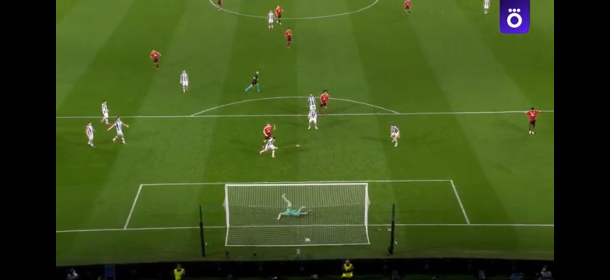

# Web browser

- The idea for the project was borrowed from [here](https://www.hackingwithswift.com/read/4/overview).

## Compared to the original version, I have slightly expanded some functionality:
- added a search bar that accepts both direct links to sites and just random queries (I configured this processing through Google);
- sites from the original project combined in the “Favorites” section;
- added a “Back” button to return to the previous viewed site;
- I made the button displaying the loading progress disappear after the page is fully loaded.

This is me watching soccer in my app :)

- Enjoy using it!
