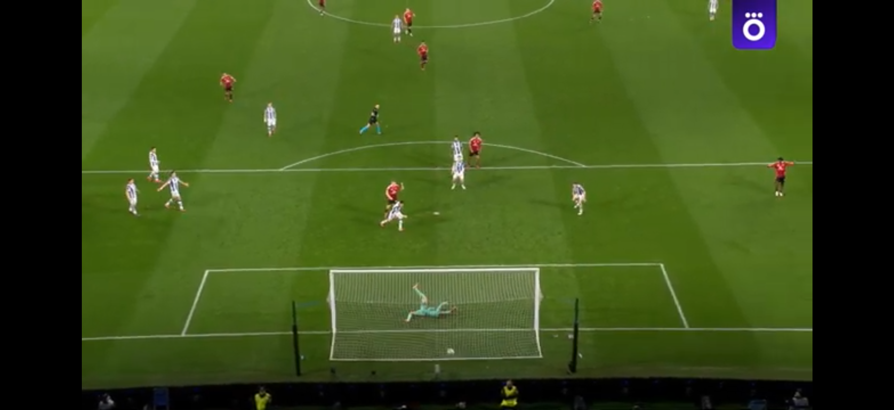

# Веб-браузер

- Идея создания проекта позаимствована [отсюда](https://www.hackingwithswift.com/read/4/overview).

## По сравнению с исхожной версией я немного расширил функционал приложения:
- добавил посковую строку, принимающую как прямые ссылки на сайты, так и просто случайные запросы (их обработку настроил через Гугл);
- сайты из исходного проекта объединил в разделе "Избранное";
- добавил кнопку "Назад", чтобы вернуться к предыдущему просмотренному сайту;
- сделал так, чтобы кнопка отображения прогресса загрузки исчезала после полной загрузки страницы.

Смотрю футбол в приложении :)

- Приятного пользования!
