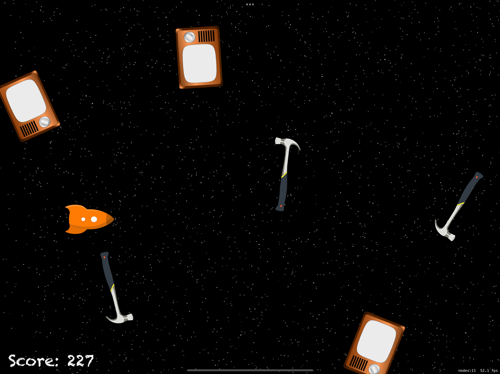

# SpriteKit Game

## This is my first experience developing a game using the SpriteKit framework.
## The idea of the project was borrowed from [here](https://www.hackingwithswift.com/read/17/overview).

- Compared to the original project, I added a start screen with the "Go!" label, the "Game Over!" label in case of touching an obstacle, and an automatic restart of the game in case of defeat.

## IMPORTANT!

- The app is designed to be played on iPad Air 13-inch (M2) in a horizontal position (I have not added any additional constraints).

- Enjpy the game!
