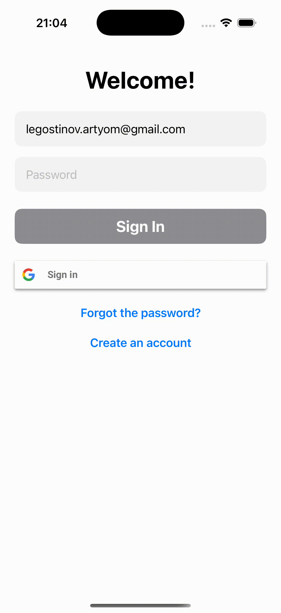

# Тестовое задание

### В этом задании мне необходимо было реализовать приложение на **SwiftUI**, содержащее в себе экраны для регистрации пользователя, его авторизации, восстановления пароля и входа через Google и главный экран приложения.

- Регистрация, авторизация и выход из приложения должны быть реализованы с использованием **Firebase** SDK, авторизация через Google - с помощью **Google Sign In** SDK.
- После успешной авторизации пользователь должен иметь возможность открыть в приложении фотографию из своего фотопотока, отредактировать её и сохранить в фотопоток новую версию.
- Функционал редактирования фотографий должен быть реализован с помощью **PencilKit**.

- На данном этапе сделан функционал по входу в приложение и выходу из него, а также по открытию фотографии из фотопотока, а также поворот выбранной фотографии по часовой и против часовой стрелки.
- Этот файл будет обновляться по мере добавления в приложение нового функционала.

