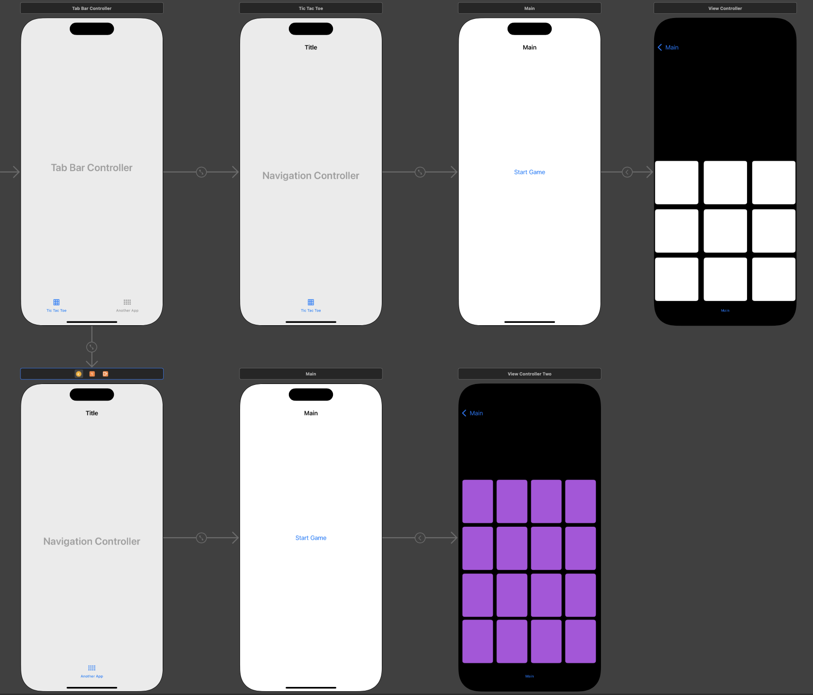

# Tic-tac-toe + Concentration

### In this project, I wrote a **“Tic-tac-toe”** game using **UIKit**, and learned how **Tab bar** and **Navigation Controller** work.

- With the help of Tab bar, I made branching.
- In addition, I wrote a **"Concentration”** - card memorization game.
- Now the user on the start screen has the option to choose which game to play.

### The general structure looks like this:

- Thanks to the creators of [course on Stepik](https://stepik.org/course/195212/) for the idea for the project.
