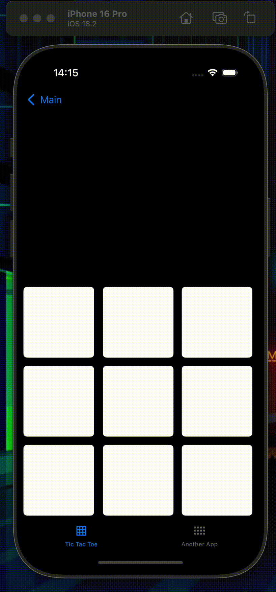
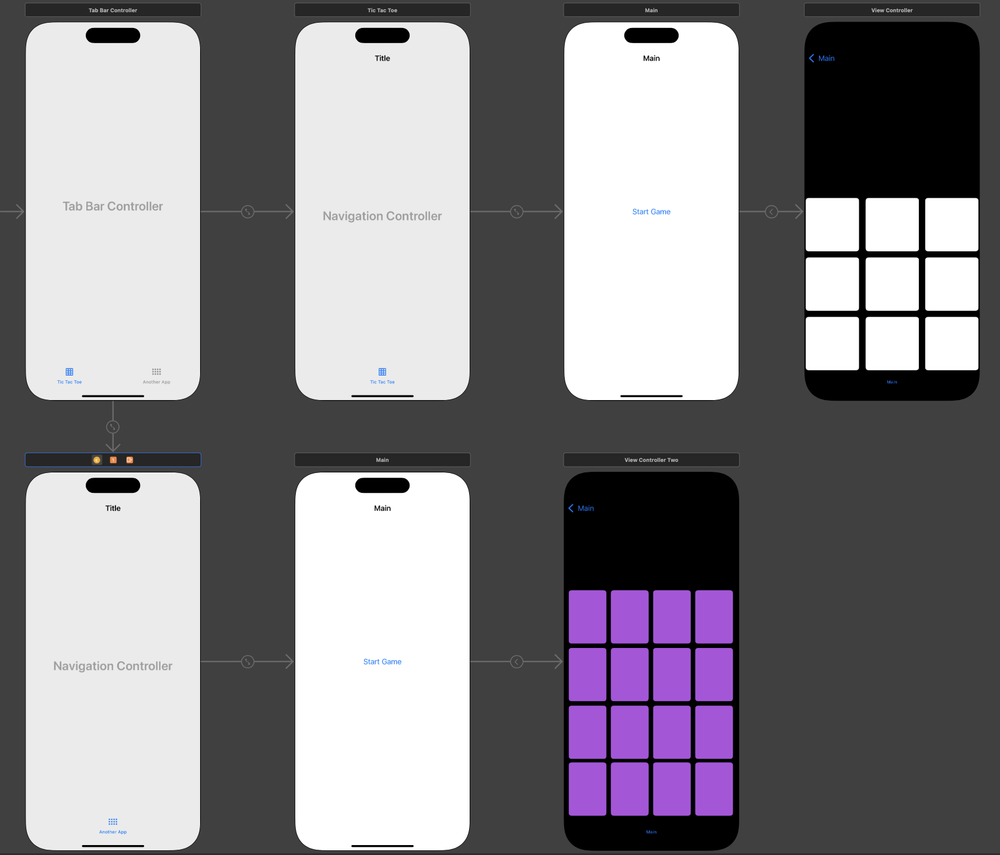

# Крестики-нолики + Концентрация

### В этом проекте я написал игру **"Крестики-нолики"** с помощью **UIKit**, а также узнал, как работают **Tab bar** и **Navigation Controller**.

- С помощью Tab bar я сделал ветвление.
- Кроме того, я дополнительно написал игру **"Концентрация"** на запоминание карточек.
- Теперь у пользователя на начальном экране есть возможность выбора, в какую игру сыграть.

### Общая структура выглядит так:

- За идею для проекта благодарю создателей [курса на Stepik](https://stepik.org/course/195212/).

- P.S.: Спустя время я сделал этот проект [на **SwiftUI**](https://github.com/t3mv-l/Swift/tree/main/SwiftUI_Detailed), добавив нового функционала и анимаций.
