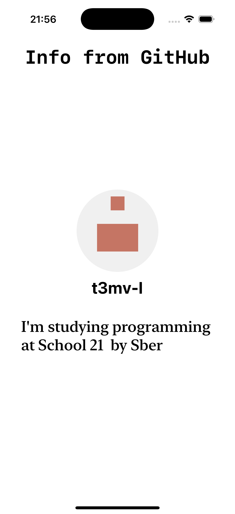

# Get data from GitHub REST API

- This is a project to reinforce the topic of parsing data from json
- Here is a simple interface written in **SwiftUI**.
- **Swift Concurrency** is used as well
- The program also has error handling

