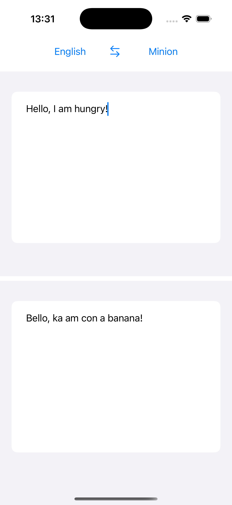
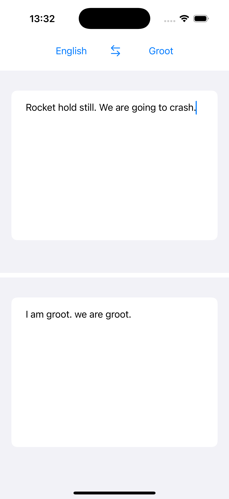
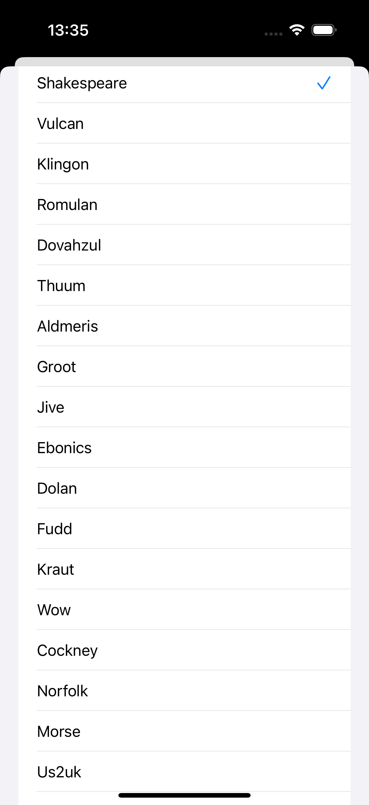

# Fun translation

### My first experience in making SwiftUI application.

- This application takes data from API and translates english text to some exotic languages like Mandalorian, Klingon etc.

- The application is implemented using a pattern *MVVM*.

