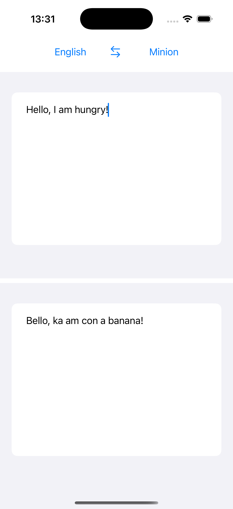

# Забавный переводчик

### Мой первый опыт написания приложения на SwiftUI.

- Приложение берёт данные из API и переводит английский текст на некоторые экзотические языки, такие как мандалорианский, клингонский и т.д.

- Приложение выполнено с использованием паттерна **MVVM**.

