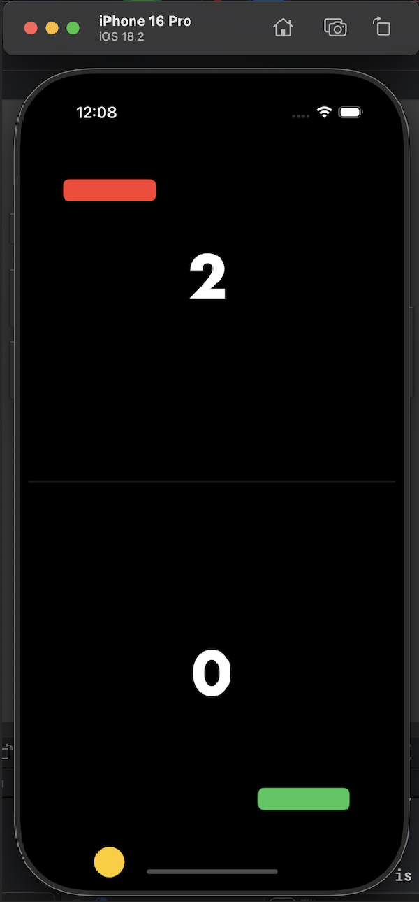

# Pong

### Pong application for freetrack on iOS-development course from Yandex.Practicum.

In this project I practiced reading other people's code, refactoring it, as well as working with **UIKit**.

- I completely changed the interface design to a more pleasing one to my eye.
- I also made a working score counter for the opponent based on the code that was written earlier.

**WARNING!**

There are only two commits in this project.

- The first is the original version of the project.
- The second is a modified version by me.

Also attached are screenshots of what the application looked like before and after my tweaking.

Before:

After:

