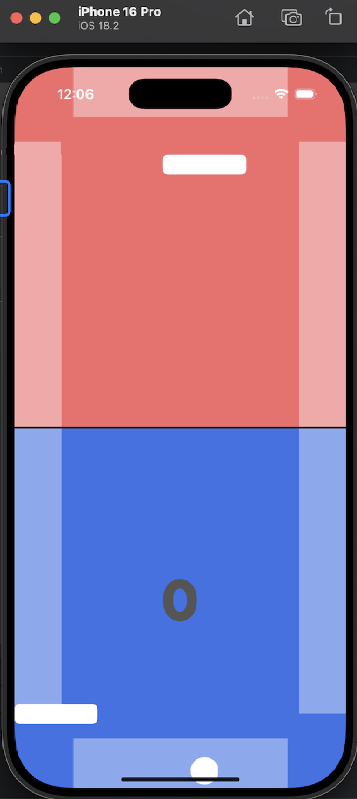

# Pong

### Приложение Pong для фритрека по курсу iOS-разработка от Яндекс.Практикум.

В этом проекте я попрактиковался в чтении чужого кода, его доработке, а также в работе с **UIKit**.

- Я полностью изменил дизайн интерфейса на более приятный моему глазу.
- Также я сделал рабочий счётчик очков для соперника на основе того кода, который был написан ранее.

**ВАЖНО!**

В этом проекте всего два коммита.

- Первый - это исходная версия проекта.
- Второй - это изменённая мной версия.

Также прилагаю Вашему вниманию скрины с тем, как выглядело приложение до моей доработки и после неё.

Было/стало:

 
